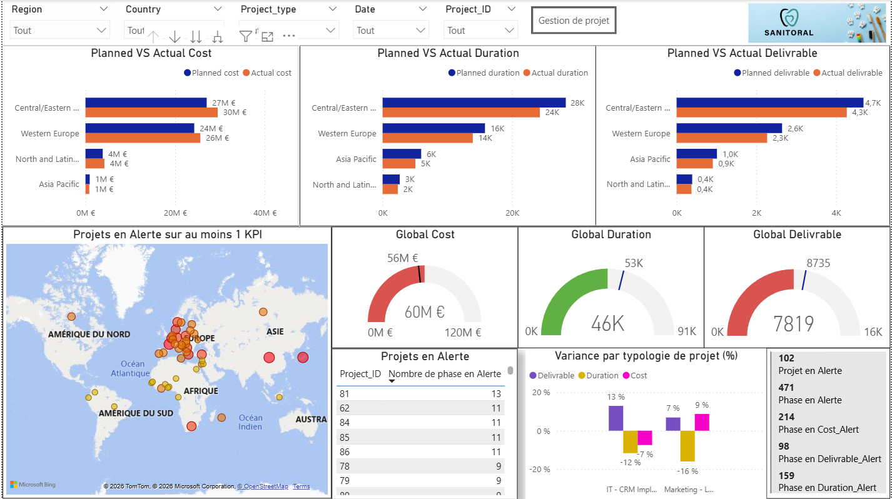
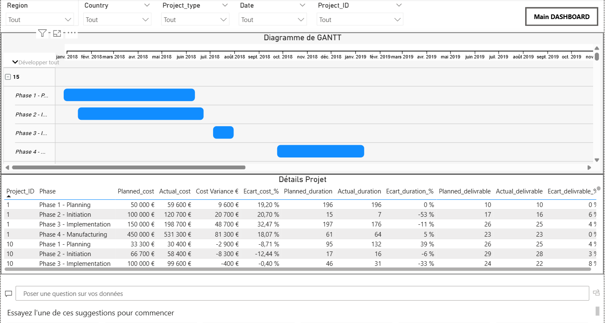

# Projet 6 : Créez un tableau de bord dynamique avec Power BI pour visualiser l'avancement de projets

## &#128203; Scénario

Vous êtes consultant Data Analyst chez ESN Data, une entreprise de services numériques (ESN).

Vous êtes déployé chez le client Sanitoral pour réaliser une mission de visualisation de données (appelée également dataviz). Il s’agit d’une société internationale qui fabrique et commercialise des soins bucco-dentaires.

Sophie est cheffe de projet au sein du service Project Management Office de Sanitoral. Vous l’avez rencontrée pour comprendre le besoin de l’entreprise.

Son service a besoin d’un tableau de bord pour :

suivre l'avancement des projets et les coûts ;

identifier les retards ;

contrôler les performances, afin que l’équipe puisse mener les actions adéquates.

Vous lui envoyez la note de cadrage du projet que vous avez établie lors de votre réunion avec elle. Avant de vous lancer dans la construction du tableau de bord, vous décidez de formaliser les user stories dans un Product Strategy Canvas à l’aide de ce modèle utilisé par les collaborateurs de ESN Data.

## &#127919; Objectifs

a venir

## &#128295; Outils utilisés

* **a venir** :
* **a venir** :

## &#127891; Compétences acquises

* a venir

## Images :

