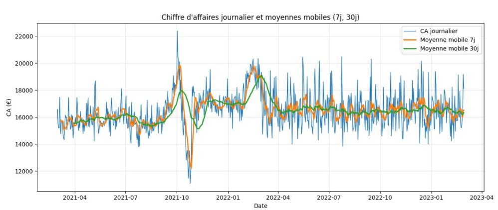
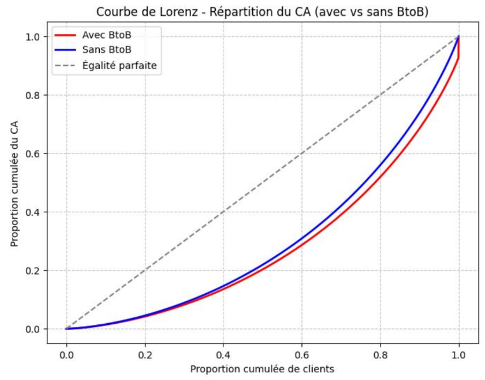

Projet 8 : Analyse des ventes d’une librairie en ligne (Lapage)

📋 Scénario  
Lapage est une librairie historique (plusieurs points de vente) qui a ouvert un site de vente en ligne il y a environ 2 ans.  
La direction souhaite comprendre les performances e-commerce et le comportement client pour orienter les prochaines décisions (offres, prix, ciblage, etc.).

🎯 Objectifs  
Produire une analyse orientée “décision” pour le CODIR (présentation 15 min, public non-technique), incluant :
- des indicateurs de vente (CA, volumes, clients, transactions, produits) et des visualisations claires ;
- un zoom produit (tops/flops, répartition par catégories) ;
- une analyse client (BtoB, concentration du CA via courbe de Lorenz) ;
- l’étude de 5 relations clés demandées par l’équipe BI (genre/catégories, âge vs montant, fréquence, panier moyen, catégories).

🔧 Outils utilisés  
- Python (Pandas) : préparation, contrôle et analyse des données.  
- Python (Matplotlib) : visualisations.  
- Google Colab Notebook : restitution technique des analyses.  
- PowerPoint : présentation synthétique pour le CODIR.

🎓 Compétences acquises  
- Préparer et fiabiliser un dataset à partir de données brutes.  
- Produire des KPI et des visualisations pour répondre à un besoin métier.  
- Analyser des comportements clients (segmentation simple, concentration du CA).  
- Tester et interpréter des relations statistiques (selon variables qualitatives/quantitatives).  
- Synthétiser des résultats en recommandations actionnables.

