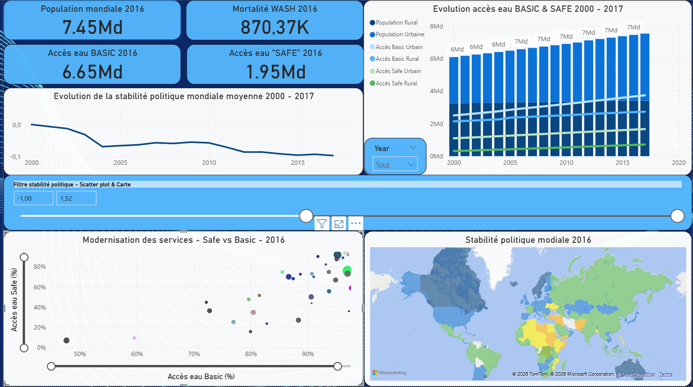
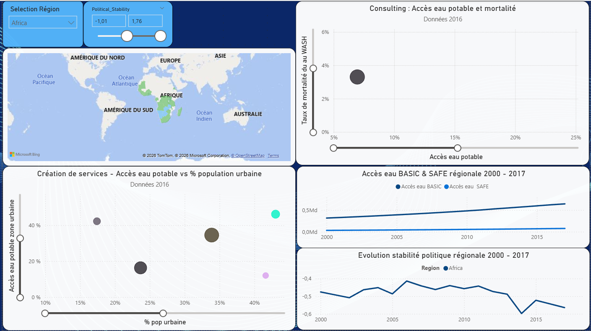
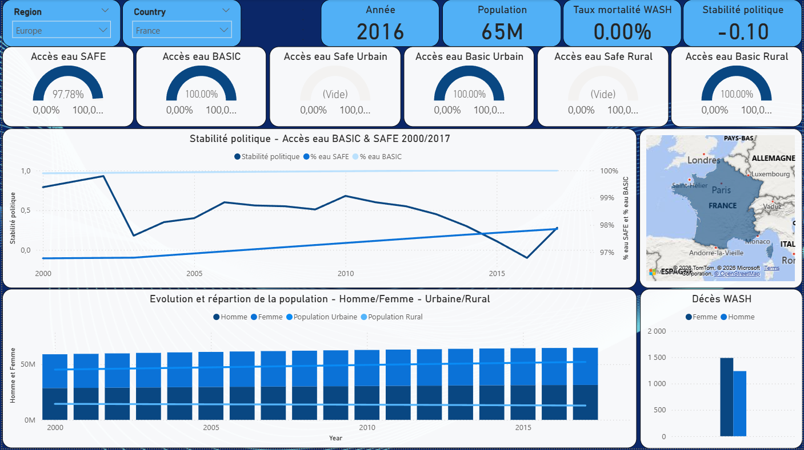

Projet 9 : DWFA – Drinking Water For All (Accès à l’eau potable)

📋 Scénario  
Vous êtes consultant Data Analyst en mission pour l’ONG DWFA (Drinking Water For All), dont l’objectif est de donner accès à l’eau potable à tous.  
DWFA dispose de 3 domaines d’expertise (création de services, modernisation, consulting) et a demandé un financement à un bailleur.  
Si le financement est accordé, il faudra choisir **dans quel pays** intervenir et **via quel domaine** : le tableau de bord doit guider cette décision. 

🎯 Objectifs  
Produire un tableau de bord (Tableau ou Power BI) destiné à un bailleur de fonds pour :
- identifier les pays en difficulté d’accès à l’eau potable ;
- identifier les pays sur lesquels concentrer les efforts de l’ONG ;
- comparer les pays via un socle d’indicateurs + des indicateurs spécifiques aux 3 domaines d’expertise ;
- proposer 3 vues (monde / continent / pays) avec filtres et interactivité ;
- présenter les résultats dans un support clair. 

🔧 Outils utilisés  
- Tableau (Story) **ou** Power BI : création des 3 pages / vues et interactivité (filtres).   
- Power Query / préparation de données (selon l’outil) : nettoyage, jointures, champs calculés. :contentReference[oaicite:3]{index=3}  
- PowerPoint (ou équivalent) : présentation du contexte, des choix d’indicateurs et démonstration du dashboard. :contentReference[oaicite:4]{index=4}

🎓 Compétences acquises  
- Sélectionner des indicateurs pertinents pour répondre à un besoin d’ONG / bailleur.   
- Préparer des données multi-sources (jointures + champs calculés) pour la dataviz. :contentReference[oaicite:6]{index=6}  
- Concevoir un dashboard multi-niveaux (monde / continent / pays) avec filtres. :contentReference[oaicite:7]{index=7}  
- Construire des visualisations imposées (line, scatter, grouped bar, stacked bar) et une lecture accessible à un public non-technique. :contentReference[oaicite:8]{index=8}  
- Présenter et justifier les choix (indicateurs, outil, lisibilité / accessibilité). 

