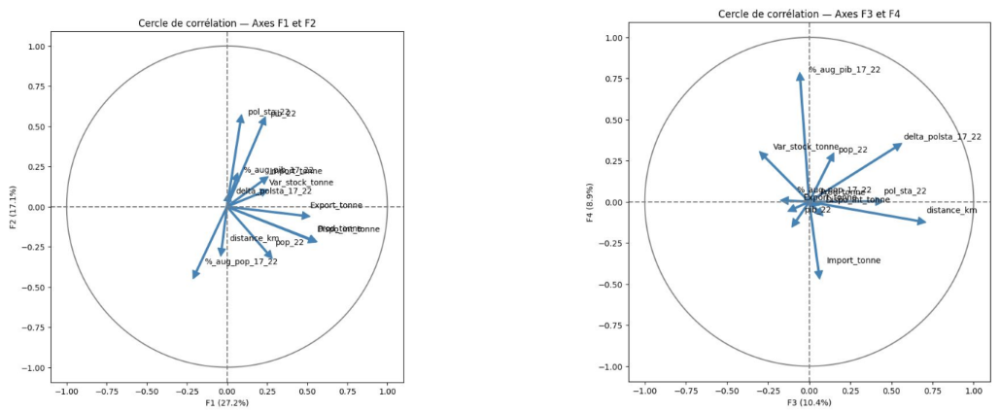
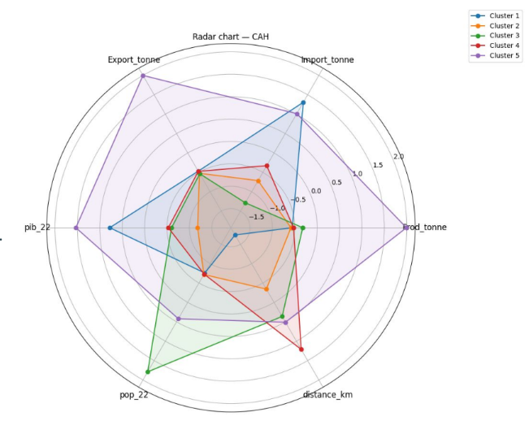
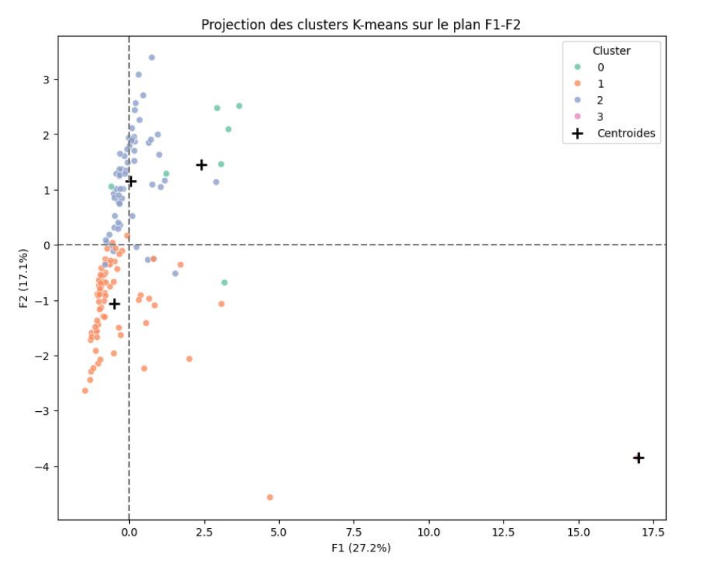

Projet 10 : La Poule qui Chante – Étude de faisabilité à l’export (ACP + Clustering)

📋 Scénario  
Vous travaillez pour **La Poule qui Chante**, une entreprise française d’agroalimentaire qui élève et vend des poulets labellisés “Poulet Agriculture Biologique”.  
Le PDG souhaite évaluer un développement à l’international, sans pays cible défini : tous les pays sont envisageables.  
Votre mission est d’identifier des **groupements de pays** pertinents à cibler pour une première phase d’export. :contentReference[oaicite:0]{index=0}

🎯 Objectifs  
Proposer au COMEX des **segments de pays** à cibler (présentation 15 min, peu technique), en :
- partant des données **FAO** et en complétant avec des sources open data ; :contentReference[oaicite:1]{index=1}  
- utilisant une analyse **PESTEL** pour sélectionner des variables pertinentes (minimum **8 variables**) ; :contentReference[oaicite:2]{index=2}  
- constituant un périmètre robuste : **≥ 100 pays** couvrant **≥ 60%** de la population mondiale ; :contentReference[oaicite:3]{index=3}  
- réalisant 2 notebooks : (1) exploration, (2) **ACP + clustering** (CAH puis K-Means) ; :contentReference[oaicite:4]{index=4}  
- produisant des recommandations de pays/segments compréhensibles par des décideurs. :contentReference[oaicite:5]{index=5}

🔧 Outils utilisés  
- Python : préparation, exploration et analyses statistiques. :contentReference[oaicite:6]{index=6}  
- Notebook 1 : exploration et contrôles qualité. :contentReference[oaicite:7]{index=7}  
- Notebook 2 : ACP + CAH + K-Means. :contentReference[oaicite:8]{index=8}  
- PowerPoint (ou équivalent) : présentation des résultats au COMEX. :contentReference[oaicite:9]{index=9}

🎓 Compétences acquises  
- Définir des variables pertinentes à partir d’une analyse **PESTEL** et de sources open data. :contentReference[oaicite:10]{index=10}  
- Préparer et consolider des données multi-sources pour une analyse internationale. :contentReference[oaicite:11]{index=11}  
- Réaliser une **ACP** (réduction de dimension, cercle des corrélations, projection des individus). :contentReference[oaicite:12]{index=12}  
- Mettre en œuvre et comparer deux approches de **clustering** (CAH et K-Means). :contentReference[oaicite:13]{index=13}  
- Transformer des résultats statistiques en **recommandations business** (segments/pays cibles). :contentReference[oaicite:14]{index=14}

