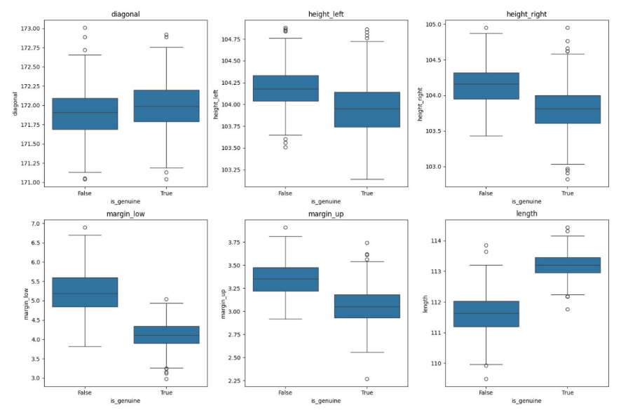
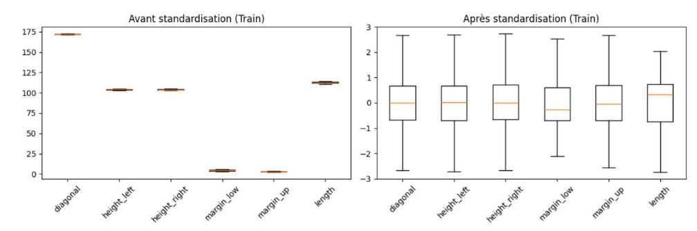
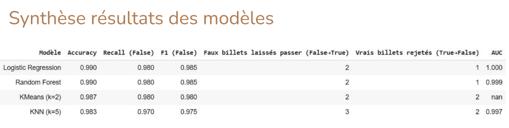

Projet 11 : ONCFM — Détection automatique de faux billets (Machine Learning)

📋 Scénario  
Votre entreprise a décroché un contrat avec l’ONCFM (Organisation nationale de lutte contre le faux-monnayage).  
L’objectif est de fournir une solution de machine learning qui, à partir des mesures d’un billet scanné, prédit automatiquement s’il est **vrai** ou **faux**. 

🎯 Objectifs  
- Réaliser une analyse descriptive du dataset (répartition des dimensions, proportion vrais/faux). :contentReference[oaicite:1]{index=1}  
- Construire un algorithme utilisant 6 variables géométriques (length, height_left, height_right, margin_up, margin_low, diagonal). :contentReference[oaicite:2]{index=2}  
- Tester et comparer 4 modèles recommandés : **Régression logistique**, **K-Means** (centroïdes), **KNN**, **Random Forest**.   
- Évaluer avec une **matrice de confusion** (faux positifs / faux négatifs) et choisir le modèle final en priorisant la détection des faux billets. :contentReference[oaicite:4]{index=4}  
- Livrer un **script** de prédiction utilisable : entrée par valeurs unitaires ou par fichier CSV (type `billets_production.csv`), sortie binaire. :contentReference[oaicite:5]{index=5}  
- Présenter la démarche et les résultats dans un support. 

🔧 Outils utilisés  
- Python : préparation des données, entraînement et évaluation des modèles.   
- Notebook : analyse descriptive + comparaison des algorithmes.   
- Script Python : application “production” de prédiction (valeurs ou CSV → vrai/faux). :contentReference[oaicite:9]{index=9}  
- PowerPoint (ou équivalent) : restitution des traitements, résultats, choix du modèle et démonstration du script. 

🎓 Compétences acquises  
- Réaliser une analyse descriptive et contrôler la qualité d’un dataset. :contentReference[oaicite:11]{index=11}  
- Mettre en concurrence plusieurs modèles de classification (supervisés et non supervisé). :contentReference[oaicite:12]{index=12}  
- Interpréter une matrice de confusion (FP/FN) selon un critère métier. :contentReference[oaicite:13]{index=13}  
- Industrialiser une prédiction via un script (entrée CSV / valeurs, sortie binaire). :contentReference[oaicite:14]{index=14}  
- Présenter des résultats de data science à un public métier. 

