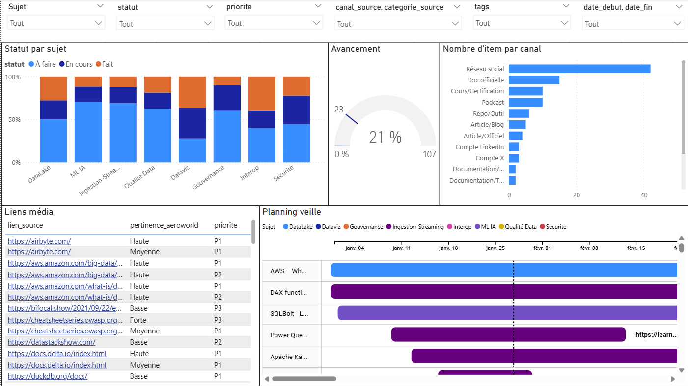
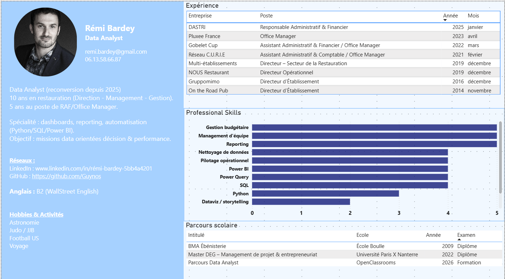

# Projet 13 : Aéroworld — Portfolio de candidature

📋 Scénario  
Vous êtes consultant data chez **Data ESN**. Suzanne vous positionne sur une mission chez **Aéroworld**, entreprise aéronautique gérant de la data à grande échelle (volumétrie, intégration multi-sources, sécurité).  
Aéroworld souhaite analyser le **portfolio des candidats** avant l’entretien : le portfolio doit être **réflexif, visuel**, et inclure des **livrables dédiés au recrutement**.

🎯 Objectifs  
Construire un portfolio de candidature qui démontre les compétences attendues pour un rôle de **Data Analyst / Chef de projet data**, en :
- réalisant une **veille métier & technologique** (tests d’outils, méthodes, sources) ;
- menant une **analyse des besoins métier** (objectifs, enjeux, contraintes) ;
- formalisant un **cahier des charges fonctionnel** ;
- organisant le projet via des **outils de gestion de projet** (Gantt) ;
- concevant 2 **tableaux de bord** :
  - un dashboard **veille** (suivi, priorisation, avancement),
  - un dashboard **profil** (présentation structurée du parcours/compétences) ;
- créant une **vidéo de formation** (Loom) sur la prise en main / création de visuels (≈ 8 min ou +) ;
- rédigeant une **documentation** claire et actionnable (procédures).

| Étape | Livrable | Format | Accès |
|---|---|---|---|
| 1 — Organisation | Carte mentale (structure + livrables) | Miro | https://miro.com/app/board/uXjVIlKdtlQ=/ |
| 2 — Cadrage | Analyse des besoins métiers – Aéroworld | PDF | [Ouvrir](./Analyse_des_besoins_métiers_Aéroworld.pdf) |
| 3 — Cadrage | Cahier des charges fonctionnel | PDF | [Ouvrir](./Cahier_des_charges_fonctionnel.pdf) |
| 4 — Planification | Diagramme de Gantt (projet portfolio) | PNG | [Ouvrir](./gantt_portfolio.png) |
| 5 — Formation | Vidéo de formation (prise en main / démonstration) | Loom | https://www.loom.com/share/4618f8e0423d458188da8e71b25b186d |
| 6 — Documentation | Procédure de création d’un graphique d’analyse data | PDF | [Ouvrir](./Procédure_de_création_d'un_graphique_d'analyse_data.pdf) |

### 📁 Accès aux dossiers
- Données : [Ouvrir le dossier](<./données/>)
- Power BI : [Ouvrir le dossier](<./Power_BI/>)

## 🖼️ Aperçus

🔧 Outils utilisés  
- **GitHub** : portfolio en ligne  
- **Power BI** : conception des 2 dashboards (veille + profil + Digramme de Gantt).  
- **Miro** : Carte mentale.  
- **Loom** : vidéo de formation.  
- **Word** : rédaction CDC + documentation.  
- **Excel**: préparation / structuration des données de veille, de profil ainsi que de planification.

🎓 Compétences démontrées / acquises  
- Effectuer une **veille métier et technologique** (tests, priorisation, synthèse).  
- **Identifier les besoins métier** en intégrant contraintes, objectifs et enjeux.  
- Rédiger un **cahier des charges fonctionnel** (périmètre, exigences, livrables).  
- **Planifier et piloter** un projet (Gantt, jalons, dépendances, risques).  
- Concevoir des **tableaux de bord** orientés décision (KPI, lisibilité, storytelling).  
- **Former et accompagner** (pédagogie, démonstration, vulgarisation).  
- Produire une **documentation** fiable et maintenable (procédures, standards).  
- Adopter une **posture de consultant** (challenge, recommandations, rigueur).
